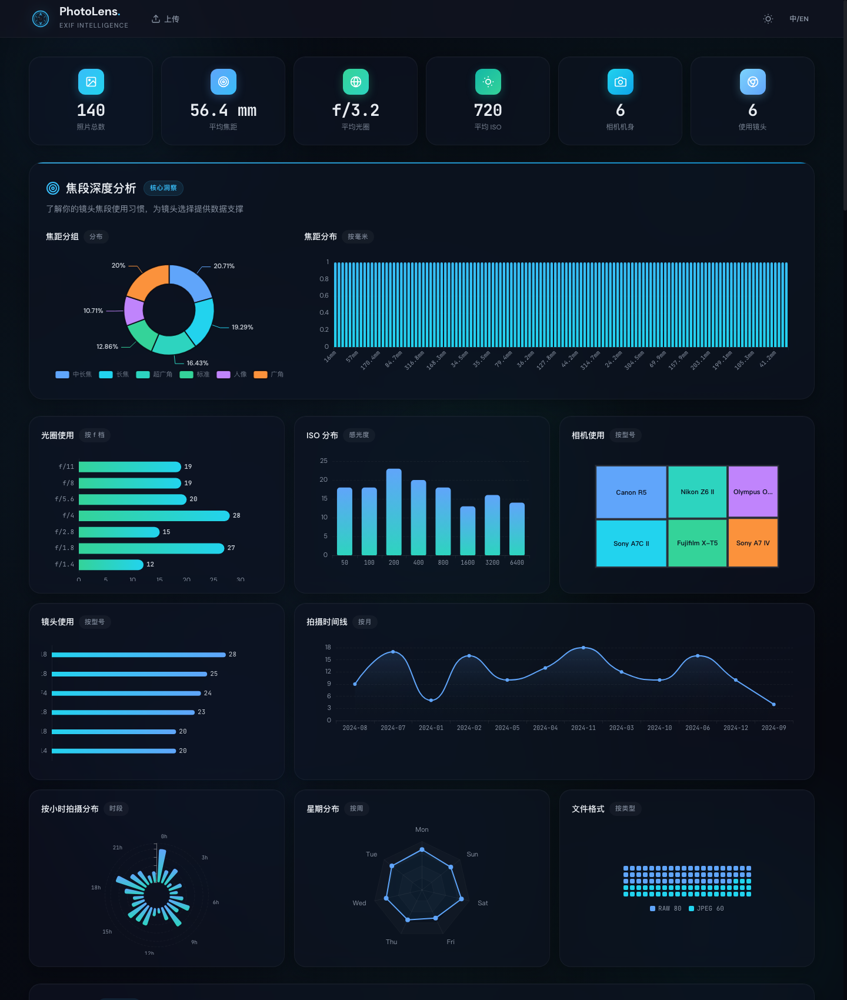

# PhotoLens Analyzer

> **[中文](#中文)** | **[English](#english)**

---

<a id="中文"></a>

# 照片镜头分析器

通过分析照片 EXIF 数据，发现你的拍摄习惯，用数据驱动镜头升级决策。



## 功能

- **多格式** — JPEG、RAW（ARW/CR2/NEF/DNG 等）、HEIF/HEIC、TIFF、PNG
- **拖拽上传** — 支持照片和整个文件夹
- **EXIF 解析** — 焦距、光圈、ISO、快门速度、相机、镜头
- **35mm 等效焦距** — 基于相机裁切系数自动换算
- **数据面板** — ECharts 交互式图表，覆盖焦段、光圈、ISO、时间线等维度
- **镜头推荐** — 根据使用数据给出升级建议
- **历史管理** — 照片持久化存储、合集分组、回收站

## 快速启动

```bash
git clone <repository-url>
cd PhotoAnalyzer
python3 -m venv .venv && source .venv/bin/activate
pip install -r requirements.txt
python start_server.py
# → http://localhost:8765
```

## 技术栈

| 层级 | 技术 |
|---|---|
| 前端 | HTML5 + CSS3 + 原生 JavaScript |
| 图表 | Apache ECharts（本地） |
| 动画 | GSAP + ScrollTrigger（本地） |
| 后端 | FastAPI + Uvicorn |
| 存储 | SQLite |
| EXIF | PIL + rawpy + pillow-heif |
| Python | 3.13 |

## 项目结构

```
PhotoAnalyzer/
├── backend/
│   ├── main.py              # API 端点
│   ├── exif_engine.py       # EXIF 提取引擎
│   ├── database.py          # 数据持久化
│   ├── auth.py              # 认证与会话
│   └── camera_data.json     # 裁切系数数据库
├── frontend/
│   ├── index.html           # 页面
│   ├── styles.css           # 样式
│   ├── app.js               # 逻辑与图表
│   └── vendor/              # ECharts、GSAP
├── start_server.py          # 开发入口
└── requirements.txt
```

## 设计系统 — "午夜镜头"

| 元素 | 深色 | 浅色 |
|---|---|---|
| 背景 | `#06080F` | `#F8FAFB` |
| 主色 | `#38BDF8` 冰川蓝 | `#0369A1` |
| 辅助 | `#3B82F6` | `#2563EB` |
| 文字 | `#E8ECF1` | `#1A1D26` |

## 许可证

[MIT](LICENSE) — 使用、修改或分发时必须保留原作者署名。

---

<a id="english"></a>

# PhotoLens Analyzer

Analyze your photo EXIF data to discover shooting habits and make data-driven lens upgrade decisions.


## Features

- **Multi-format** — JPEG, RAW (ARW/CR2/NEF/DNG, etc.), HEIF/HEIC, TIFF, PNG
- **Drag & drop** — upload photos or entire folders
- **EXIF parsing** — focal length, aperture, ISO, shutter speed, camera, lens
- **35mm equivalent** — auto-converts via crop-factor database
- **Dashboard** — interactive ECharts covering focal length, aperture, ISO, timeline, and more
- **Lens recommendations** — data-driven upgrade suggestions
- **History management** — persistent photo storage, collections, recycle bin

## Quick Start

```bash
git clone <repository-url>
cd PhotoAnalyzer
python3 -m venv .venv && source .venv/bin/activate
pip install -r requirements.txt
python start_server.py
# → http://localhost:8765
```

## Tech Stack

| Layer | Tech |
|---|---|
| Frontend | HTML5 + CSS3 + Vanilla JavaScript |
| Charts | Apache ECharts (local) |
| Animations | GSAP + ScrollTrigger (local) |
| Backend | FastAPI + Uvicorn |
| Storage | SQLite |
| EXIF | PIL + rawpy + pillow-heif |
| Python | 3.13 |

## Project Structure

```
PhotoAnalyzer/
├── backend/
│   ├── main.py              # API endpoints
│   ├── exif_engine.py       # EXIF extraction engine
│   ├── database.py          # Data persistence
│   ├── auth.py              # Auth & session management
│   └── camera_data.json     # Crop-factor database
├── frontend/
│   ├── index.html           # Page
│   ├── styles.css           # Styles
│   ├── app.js               # Logic & charts
│   └── vendor/              # ECharts, GSAP
├── start_server.py          # Dev entry point
└── requirements.txt
```

## Design System — "Midnight Lens"

| Element | Dark | Light |
|---|---|---|
| Background | `#06080F` | `#F8FAFB` |
| Accent | `#38BDF8` glacier blue | `#0369A1` |
| Secondary | `#3B82F6` | `#2563EB` |
| Text | `#E8ECF1` | `#1A1D26` |

## License

[MIT](LICENSE) — you must retain the original author attribution when using, modifying, or distributing this project.
